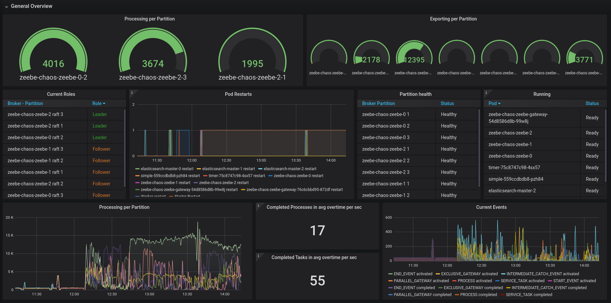
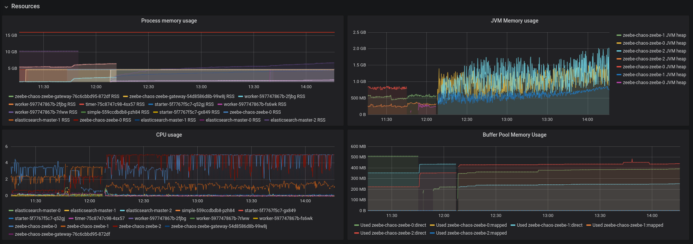

# Chaos Day Summary

 * Failure documentation about RAFT
 * Added chaos day summaries to repo
 * Run Chaos experiment with a lot of timers
 * Run Chaos experiment with huge variables

## Chaos Experiment

### A Lot of Timers 

Based on the Hypothesis written here:  https://github.com/zeebe-io/zeebe-chaos/issues/31 we run an exeperiment with a stable load of 10 simple workflow instances per second (only start and end event) and 10 workflow instances with 

We wanted to explore what happens when we have a lot of timers running and especially what happens when the are triggered at once. We created the following workflow model, where timers are exponentially created.

The experiments is based on the hypotheses we wrote here https://github.com/zeebe-io/zeebe-chaos/issues/31.

#### Expectations 

 * at some point we can't create new instances from out side, since backpressure will block that
 * the metrics for processing records (events/commands) should be stable since there will be always new events/records
 * the cluster itself should be stable

#### Observations

During running the experiments we saw that indeed we were not able to create new instances at some point.
The cluster kept stable and there was no leader change at all. Unexpected was the behavior of the processing record metrics, since it fluctuates a lot.

Furthermore we reached really high processing records throughput, which we normally not see.

The log appender backpressure seem to work, at some point it deferred around 1.3 million records.

Resource consumption seem to be ok.

Interesting was that we saw a huge difference between processing and exporting.

 

The issue we currently have is that we stop processing to trigger/evaluate due timers and write them to the log.
After we did that we will process a bunch of events again and then trigger/evaluate again. I think this should be decoupled to streamline the processing throughput.

### Huge Variables

In order to understand better what is the impact of huge variables I did a small experiment with a payload which was ~ 5 MB.

I expected that this will not work, since this is larger then the maximum message size. I would expect an appropriate error message, but unfortunately I just got a cancel on the client side.

