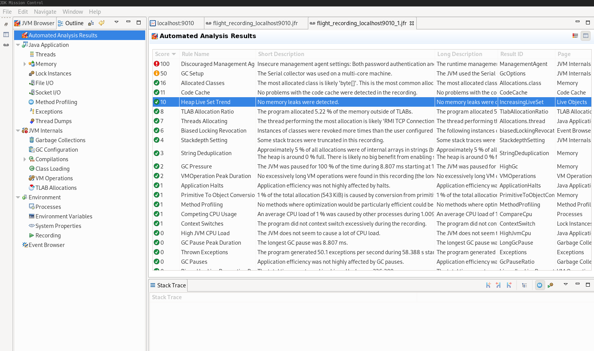
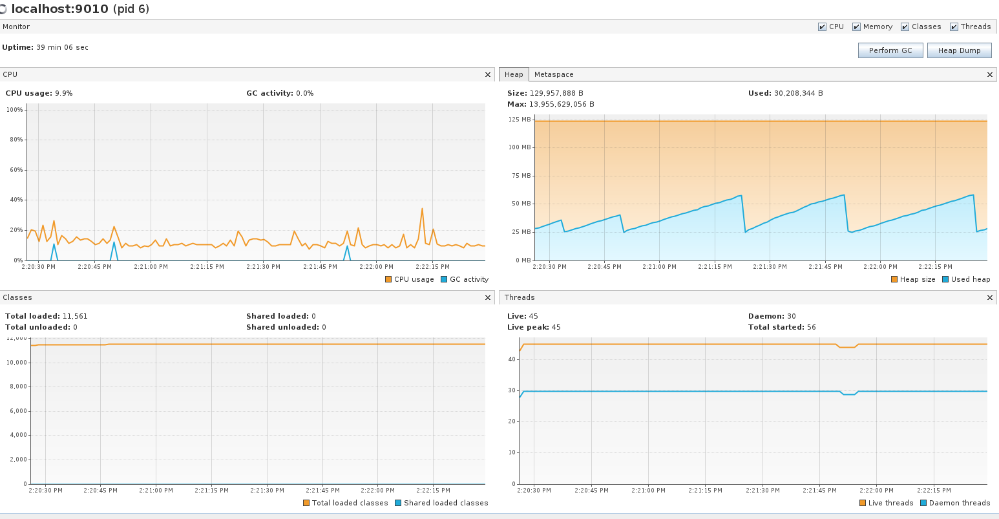

# Chaos Day Summary

In the last weeks I check multiple benchmarks and clusters in incidents. Often I had the feeling that the memory consumption from the gateway is not ideal
or that there is a memory leak. I wanted to experiment regarding this memory consumptions. Since we saw in investigating https://github.com/zeebe-io/zeebe/issues/5641 a high memory spike
when the gateway was not able to talk to other nodes I suspected that here might be some bugs hiding


## Chaos experiment

We will run the Standalone gateway without the brokers and put load on it. 

### Expected

All requests are rejected by the gateway and the memory doesn't grow infinitly on a steady load. The memory consumption should be stable at some point.

### Actual

First I run the standalone gateway without any load. It seems that benchmarks without brokers are not shown in our dashboard namespaces. I fixed that for my experiment in my local grafana session. The issue was that we search for a `atomix_role` metric to get the related namespaces. This metrics is only published on broker side.


We can see that even if there is no load the memory is already growing.

Putting more load on it showed that it doesn't drastically increase the memory consumption, but still it was growing.


I think the issue here is that we currently have no limits set for the gateway, which means it will use as many as it can. There is also no pressure for the GC to run or reclaim memory.
We probably want to limit it at somepoint. I created an issue for it [#5699](https://github.com/zeebe-io/zeebe/issues/5699) In order to find out whether we have a memory leak I used a profiler.

I restarted the experiment with new settings:

```
# JavaOpts:
# DEFAULTS
JavaOpts: >-
  # other options
  -Djava.rmi.server.hostname=127.0.0.1
  -Dcom.sun.management.jmxremote.port=9010
  -Dcom.sun.management.jmxremote.rmi.port=9010
  -Dcom.sun.management.jmxremote.authenticate=false
  -Dcom.sun.management.jmxremote.ssl=false
  -Dcom.sun.management.jmxremote.local.only=false
```
> This will open a remote, unauthenticated, plaintext JMX connection - do not use this configuration in production!
See https://github.com/zeebe-io/zeebe/blob/develop/benchmarks/docs/debug/README.md#remote_jmx

After I added a port forwarding I was able to open an JMX connection with Java Mission Control.

### Conclusion

I profiled the gateway with and without load but haven't found no memory leak so far.



With VisualVM and triggering multiple GC's.



### Other Observations

#### SerialGC usage

Java Mission Control reported as an error that on a multi-core machine the serial garabage collector was used.
If we check the JVM properties we can see that as well.


This is weird because we don't set any GC in our benchmarks, so I would suspect the G1 is used with Java 11. Unfortunately this depends on the available resources which are "detected" by the JVM.
Related to that https://stackoverflow.com/questions/52474162/why-is-serialgc-chosen-over-g1gc
I think we should investigate that further, because we can see in Java mission control that we have GC pauses up to 8 seconds! I created a new issue for it [5700](https://github.com/zeebe-io/zeebe/issues/5700).

#### Unexpected responses

When we start the `starters` they will first try to deploy a workflow model and loop in this state until they succeed. 
In the metrics we can see that the responses to the deployment commands are `NOT_FOUND` instead of `PARTITION_NOT_AVAILABLE`, which I would expect.


We can also see that in the log of the starter:
```
11:01:18.035 [main] WARN  io.zeebe.Starter - Failed to deploy workflow, retrying
io.zeebe.client.api.command.ClientStatusException: Expected to execute command, but this command refers to an element that doesn't exist.
	at io.zeebe.client.impl.ZeebeClientFutureImpl.transformExecutionException(ZeebeClientFutureImpl.java:93) ~[app.jar:0.24.2]
	at io.zeebe.client.impl.ZeebeClientFutureImpl.join(ZeebeClientFutureImpl.java:50) ~[app.jar:0.24.2]
	at io.zeebe.Starter.deployWorkflow(Starter.java:128) [app.jar:0.24.2]
	at io.zeebe.Starter.run(Starter.java:55) [app.jar:0.24.2]
	at io.zeebe.App.createApp(App.java:50) [app.jar:0.24.2]
	at io.zeebe.Starter.main(Starter.java:142) [app.jar:0.24.2]
Caused by: java.util.concurrent.ExecutionException: io.grpc.StatusRuntimeException: NOT_FOUND: Expected to execute command, but this command refers to an element that doesn't exist.
	at java.util.concurrent.CompletableFuture.reportGet(Unknown Source) ~[?:?]
	at java.util.concurrent.CompletableFuture.get(Unknown Source) ~[?:?]
	at io.zeebe.client.impl.ZeebeClientFutureImpl.join(ZeebeClientFutureImpl.java:48) ~[app.jar:0.24.2]
	... 4 more
Caused by: io.grpc.StatusRuntimeException: NOT_FOUND: Expected to execute command, but this command refers to an element that doesn't exist.
	at io.grpc.Status.asRuntimeException(Status.java:533) ~[app.jar:0.24.2]
	at io.grpc.stub.ClientCalls$StreamObserverToCallListenerAdapter.onClose(ClientCalls.java:460) ~[app.jar:0.24.2]
	at io.grpc.PartialForwardingClientCallListener.onClose(PartialForwardingClientCallListener.java:39) ~[app.jar:0.24.2]
	at io.grpc.ForwardingClientCallListener.onClose(ForwardingClientCallListener.java:23) ~[app.jar:0.24.2]
	at me.dinowernli.grpc.prometheus.MonitoringClientCallListener.onClose(MonitoringClientCallListener.java:50) ~[app.jar:0.24.2]
	at io.grpc.internal.ClientCallImpl.closeObserver(ClientCallImpl.java:426) ~[app.jar:0.24.2]
	at io.grpc.internal.ClientCallImpl.access$500(ClientCallImpl.java:66) ~[app.jar:0.24.2]
	at io.grpc.internal.ClientCallImpl$ClientStreamListenerImpl.close(ClientCallImpl.java:689) ~[app.jar:0.24.2]
	at io.grpc.internal.ClientCallImpl$ClientStreamListenerImpl.access$900(ClientCallImpl.java:577) ~[app.jar:0.24.2]
	at io.grpc.internal.ClientCallImpl$ClientStreamListenerImpl$1StreamClosed.runInternal(ClientCallImpl.java:751) ~[app.jar:0.24.2]
	at io.grpc.internal.ClientCallImpl$ClientStreamListenerImpl$1StreamClosed.runInContext(ClientCallImpl.java:740) ~[app.jar:0.24.2]
	at io.grpc.internal.ContextRunnable.run(ContextRunnable.java:37) ~[app.jar:0.24.2]
	at io.grpc.internal.SerializingExecutor.run(SerializingExecutor.java:123) ~[app.jar :0.24.2]
	at java.util.concurrent.ThreadPoolExecutor.runWorker(Unknown Source) ~[?:?]
	at java.util.concurrent.ThreadPoolExecutor$Worker.run(Unknown Source) ~[?:?]
	at java.lang.Thread.run(Unknown Source) ~[?:?]
```

This doesn't make any sense. I created a new issue for it [#5702](https://github.com/zeebe-io/zeebe/issues/5702)

## New Issues

 * Limit Gateway https://github.com/zeebe-io/zeebe/issues/5699
 * SerialGC usage https://github.com/zeebe-io/zeebe/issues/5700
 * Wrong error response on deployment command https://github.com/zeebe-io/zeebe/issues/5702
 
## Participants

  * @zelldon


