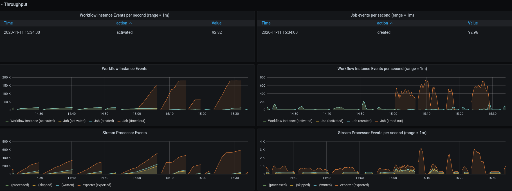
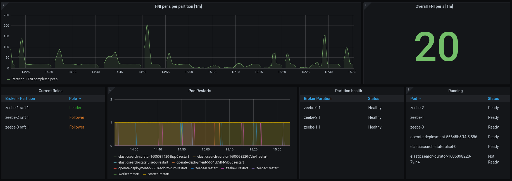

# Chaos Day Summary

In the last game day (on friday 06.11.2020) I wanted to test whether we can break a partition if many messages time out at the same time. What I did was I send many many messages with a decreasing TTL, which all targeting a specific point in time, such that they will all timeout at the same time. I expected that if this happens that the processor will try to time out all at once and break because the batch is to big. Fortunately this didn't happen, the processor was able to handle this.

I wanted to verify the same with job time out's.

## Chaos Experiment

I setup an Production S cluster in camunda cloud. Deployed an normal starter, which starts 20 workflow instances per second. I used similar code to activate jobs with a decreasing timeout, such that they all timeout at the same time. The target time was 3 PM. I started the test ~11 am.

**Code:**
```csharp
            var now = DateTime.Now;
            var today3PM = now.Date.AddHours(15);
            int count = 0;
            var totalMilli = (today3PM - now).TotalMilliseconds;
            do
            {
                try
                {

                    await client
                        .NewActivateJobsCommand()
                        .JobType("benchmark-task")
                        .MaxJobsToActivate(100)
                        .Timeout(TimeSpan.FromMilliseconds(totalMilli))
                        .WorkerName("lol")
                        .Send(TimeSpan.FromSeconds(30));
                    count++;

                    totalMilli = (today3PM - DateTime.Now).TotalMilliseconds;
                    if (count % 10 == 0)
                    {
                        Console.WriteLine("Activated next 1000, count:" + count);
                        Console.WriteLine("Total " + totalMilli + " ms until 3 am");
                    }
                }
                catch (Exception ex)
                {
                    Console.WriteLine("Failed to activate job, because of " + ex.Message);
                }
            } while (totalMilli > 0);

```

I experienced a lot of pod restarts during the experiment, but at 3 pm the processor seems to handle the situation correctly and has no problems with so many events.





## Related issues

### No worker name

First I missed the `.WorkerName` in the activation command and this broke somehow the activation.
In the client I got either timeouts or resource exhausted responses, but in the gateway I saw that the worker name is missing.

**Gateway output:**

```
io.zeebe.gateway.cmd.BrokerRejectionException: Command (ACTIVATE) rejected (INVALID_ARGUMENT): Expected to activate job batch with worker to be present, but it was blank
	at io.zeebe.gateway.impl.broker.BrokerRequestManager.handleResponse(BrokerRequestManager.java:185) ~[zeebe-gateway-0.25.0.jar:0.25.0]
	at io.zeebe.gateway.impl.broker.BrokerRequestManager.lambda$sendRequestInternal$2(BrokerRequestManager.java:137) ~[zeebe-gateway-0.25.0.jar:0.25.0]
	at io.zeebe.util.sched.future.FutureContinuationRunnable.run(FutureContinuationRunnable.java:28) [zeebe-util-0.25.0.jar:0.25.0]
	at io.zeebe.util.sched.ActorJob.invoke(ActorJob.java:76) [zeebe-util-0.25.0.jar:0.25.0]
	at io.zeebe.util.sched.ActorJob.execute(ActorJob.java:39) [zeebe-util-0.25.0.jar:0.25.0]
	at io.zeebe.util.sched.ActorTask.execute(ActorTask.java:122) [zeebe-util-0.25.0.jar:0.25.0]
	at io.zeebe.util.sched.ActorThread.executeCurrentTask(ActorThread.java:107) [zeebe-util-0.25.0.jar:0.25.0]
	at io.zeebe.util.sched.ActorThread.doWork(ActorThread.java:91) [zeebe-util-0.25.0.jar:0.25.0]
	at io.zeebe.util.sched.ActorThread.run(ActorThread.java:204) [zeebe-util-0.25.0.jar:0.25.0]
```

**Client output:**

```
Failed to activate job, because of Status(StatusCode="DeadlineExceeded", Detail="Deadline Exceeded", DebugException="Grpc.Core.Internal.CoreErrorDetailException: {"created":"@1605092309.325960242","description":"Error received from peer ipv4:35.205.156.246:443","file":"/var/local/git/grpc/src/core/lib/surface/call.cc","file_line":1062,"grpc_message":"Deadline Exceeded","grpc_status":4}")
```

After adding the worker name it works, but begins with lot of resource exhausted. I created a new issue for it https://github.com/zeebe-io/zeebe/issues/5812 .

## Pod restarts


Every 10 min it seems to be a node dying, which causes resource exhausted then.

After looking at the [gke events](https://console.cloud.google.com/logs/viewer?interval=PT1H&authuser=1&organizationId=669107107215&project=camunda-cloud-240911&minLogLevel=0&expandAll=false&timestamp=2020-11-11T14:04:53.000000000Z&customFacets=&limitCustomFacetWidth=true&advancedFilter=jsonPayload.kind%3D%22Event%22%0Aresource.labels.cluster_name%3D%22ultrachaos%22%0AjsonPayload.involvedObject.namespace%3D%2299c029a3-b6ae-4e7b-a2aa-6496adebf94c-zeebe%22%0AjsonPayload.involvedObject.name:%22zeebe%22&scrollTimestamp=2020-11-11T13:49:52.000000000Z&dateRangeEnd=2020-11-11T14:06:47.813Z&dateRangeStart=2020-11-11T13:06:47.813Z) I saw now evidence that this is caused by node preemptions. 

I checked the pods directly and saw no heap dumps in the data folder. After describing the pod I can see:

```
[zell zeebe-cluster-testbench/ ns:99c029a3-b6ae-4e7b-a2aa-6496adebf94c-zeebe]$ k describe pod zeebe-1
Name:         zeebe-1
Namespace:    99c029a3-b6ae-4e7b-a2aa-6496adebf94c-zeebe
Priority:     0
Node:         gke-ultrachaos-compute-fea23edf-tqbm/10.132.0.58
Start Time:   Wed, 11 Nov 2020 14:49:52 +0100
Labels:       app.kubernetes.io/app=zeebe
              app.kubernetes.io/component=gateway
              controller-revision-hash=zeebe-66b694fbfc
              statefulset.kubernetes.io/pod-name=zeebe-1
Annotations:  <none>
Status:       Running
IP:           10.56.7.16
IPs:
  IP:           10.56.7.16
Controlled By:  StatefulSet/zeebe
Containers:
  zeebe:
    Container ID:   docker://a55fe90d3184bea064aec29d845680241096b0d971d66b05a35495857c5d7427
    Image:          camunda/zeebe:0.25.0
    Image ID:       docker-pullable://camunda/zeebe@sha256:1286086e786975837dcbf664daa29d41d2666af4daf4abd3192fff1426804dd6
    Ports:          9600/TCP, 26500/TCP, 26501/TCP, 26502/TCP, 26503/TCP, 26504/TCP
    Host Ports:     0/TCP, 0/TCP, 0/TCP, 0/TCP, 0/TCP, 0/TCP
    State:          Waiting
      Reason:       CrashLoopBackOff
    Last State:     Terminated    <=====
      Reason:       OOMKilled    <====
      Exit Code:    137   
      Started:      Wed, 11 Nov 2020 16:06:59 +0100
      Finished:     Wed, 11 Nov 2020 16:16:19 +0100
    Ready:          False
```

Furthermore we can see the `JAVA_OPTIONS`, which are:

```
JAVA_TOOL_OPTIONS:                                -XX:MaxRAMPercentage=50.0 -XX:InitialRAMPercentage=25.0 -XX:+ExitOnOutOfMemoryError -XX:+HeapDumpOnOutOfMemoryError
```

I was wondering why we not setting any path for the heap dump. @npepinpe mentioned that this is done in the start up script.

It is true this is part of the script:

```sh
[zell zeebe-cluster-testbench/ ns:99c029a3-b6ae-4e7b-a2aa-6496adebf94c-zeebe]$ k describe configmaps zeebe-configmap 
Name:         zeebe-configmap
Namespace:    99c029a3-b6ae-4e7b-a2aa-6496adebf94c-zeebe
Labels:       cloud.camunda.io/channel=Internal_Dev
              cloud.camunda.io/clusterPlan=Production_S_v1
              cloud.camunda.io/clusterPlanType=Production_S
              cloud.camunda.io/generation=Zeebe_0_25_0
              cloud.camunda.io/internalSalesPlan=false
              cloud.camunda.io/orgName=the_org_with_the_big_cluster
              cloud.camunda.io/salesPlan=Paid
Annotations:  <none>

Data
====
startup.sh:
----
# ...
# append datestamped heapdump path
export JAVA_TOOL_OPTIONS="${JAVA_TOOL_OPTIONS} -XX:HeapDumpPath=/usr/local/zeebe/data/java_started_$(date +%s).hprof"

env
exec /usr/local/zeebe/bin/broker
```

Unfortunately this is not visible outside of this context, which is why I thought it is not set.

```sh
root@zeebe-0:/usr/local/zeebe# java -XX:+UnlockDiagnosticVMOptions -XX:+PrintFlagsFinal -version
Picked up JAVA_TOOL_OPTIONS: -XX:MaxRAMPercentage=50.0 -XX:InitialRAMPercentage=25.0 -XX:+ExitOnOutOfMemoryError -XX:+HeapDumpOnOutOfMemoryError

#...

    bool HeapDumpBeforeFullGC                     = false                                  {manageable} {default}
     bool HeapDumpOnOutOfMemoryError               = true                                   {manageable} {environment}
    ccstr HeapDumpPath                             =                                        {manageable} {default}
    uintx HeapFirstMaximumCompactionCount          = 3                                         {product} {default}

#...
```

```sh
root@zeebe-0:/usr/local/zeebe# env | grep JAVA
JAVA_HOME=/usr/local/openjdk-11
JAVA_TOOL_OPTIONS=-XX:MaxRAMPercentage=50.0 -XX:InitialRAMPercentage=25.0 -XX:+ExitOnOutOfMemoryError -XX:+HeapDumpOnOutOfMemoryError
JAVA_VERSION=11.0.8
root@zeebe-0:/usr/local/zeebe# 

```

I think we should give the production s cluster plans a bit more memory, currently has 2 gig and java can use only 1 gig. It is currently quite easy to overload the brokers and kill them with a small load.

## New Issues

 * [#5812](https://github.com/zeebe-io/zeebe/issues/5812) 
 
## Participants

  * @zelldon
