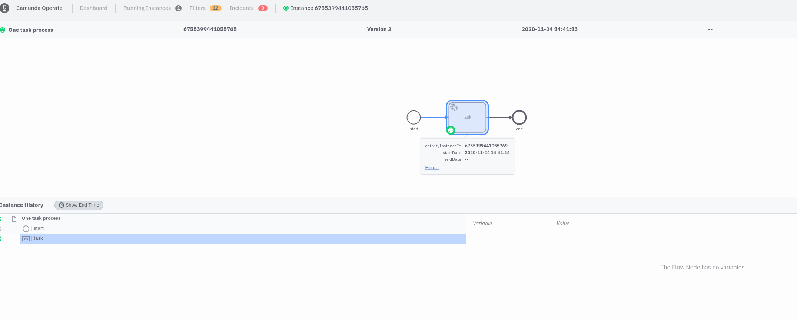

# Chaos Day Summary

Today I wanted to finally implement an experiment which I postponed for long time, see [#24](https://github.com/zeebe-io/zeebe-chaos/issues/24).
The problem was that previous we were not able to determine on which partition the message was published, so we were not able to assert that it was published on the correct partition. With this [#4794](https://github.com/zeebe-io/zeebe/issues/4794) it is now possible, which was btw an community contribution. :tada:

<!--truncate-->

## Chaos Experiment

We want to publish a message to a specific partition. After publishing the message we want to restart the corresponding leader of that partition, deploy and create a workflow instance to which the message should correlate to. 

### Hypothesis

We expect that even due to a leader change messages can be correlated to a workflow instance, after a new leader comes up for that partition.

### Actual

#### Implementation
 The experiment should ideally work on all cluster plans, since we run the chaos experiments now with all existing cluster plans. For that we want to publish the message on partition one. In Zeebe the messages are distributed over the partitions via the correlation key. Our current cluster plans have 1, 4 or 8 partitions. In order to always reach the same partition we need a correlation key which is modulo the partition count always the same number. Ideally it is just one character, which makes the calculation easier. If we take a look at the ASCII table we see that for example `48 mod 1, 4 or 8` is always `0`. This would correspond then to partition one, since in the partition calculation we add 1. If we use "0" as correlation key we can be sure this will end up in the production clusters on partition one. For more information about the calculate you can check the [SubscriptionUtil](https://github.com/zeebe-io/zeebe/blob/develop/protocol-impl/src/main/java/io/zeebe/protocol/impl/SubscriptionUtil.java) class.

The process is quite simple, we just have one intermediate message catch event and we will create an new instance and await the result. With that we make sure that the message was correlated correctly.


On testing the separate scripts I had at the begining problems with the `awaitResult`. I got always timeouts.

```sh
Error: rpc error: code = DeadlineExceeded desc = Time out between gateway and broker: Request type command-api-4 timed out in 8999 milliseconds
command terminated with exit code 1
+ echo 'Failed to execute: '\''awaitInstance'\''. Retry.'
```



Via operate nor via zbctl it is easy to find out what is the real issue. I'm not able to see any details regarding the intermediate message catch event in operate. With help of [zdb](https://github.com/Zelldon/zdb) I was able to track down the issue. The time to live was to small. The published messages have been already deleted before I created the corresponding workflow instancs. Per default the time to live is `5s` with `zbctl`. It is not easy to find out why the message doesn't correlate. After setting the `ttl` quite high it works and I can run my experiment successfully.

#### Result

```sh
$ chaos run production-m/msg-correlation/experiment.json 
[2020-11-24 14:56:28 INFO] Validating the experiment's syntax
[2020-11-24 14:56:28 INFO] Experiment looks valid
[2020-11-24 14:56:28 INFO] Running experiment: Zeebe message correlation experiment
[2020-11-24 14:56:28 INFO] Steady-state strategy: default
[2020-11-24 14:56:28 INFO] Rollbacks strategy: default
[2020-11-24 14:56:28 INFO] Steady state hypothesis: Zeebe is alive
[2020-11-24 14:56:28 INFO] Probe: All pods should be ready
[2020-11-24 14:56:28 INFO] Steady state hypothesis is met!
[2020-11-24 14:56:28 INFO] Playing your experiment's method now...
[2020-11-24 14:56:28 INFO] Action: Publish message to partition one
[2020-11-24 14:56:29 INFO] Action: Terminate leader of partition 1 non-gracefully
[2020-11-24 14:56:34 INFO] Probe: Should be able to create a workflow and await the message correlation
[2020-11-24 14:56:39 INFO] Steady state hypothesis: Zeebe is alive
[2020-11-24 14:56:39 INFO] Probe: All pods should be ready
[2020-11-24 14:57:16 INFO] Steady state hypothesis is met!
[2020-11-24 14:57:16 INFO] Let's rollback...
[2020-11-24 14:57:16 INFO] No declared rollbacks, let's move on.
[2020-11-24 14:57:16 INFO] Experiment ended with status: completed
```

Experiment added to all cluster plans:
 * https://github.com/zeebe-io/zeebe-chaos/commit/adeab53915e12b4a76fd4d49bb359684619b117f
 * https://github.com/zeebe-io/zeebe-chaos/commit/93daf11864fdd851267dae67fdfc31e0ea78b407


## New Issues

 * Operate: Show details of an intermediate catch event [OPE-1165](https://jira.camunda.com/browse/OPE-1165)

## Participants

  * @zelldon
