# Chaos Day Summary

As you can see, I migrated the old chaos day summaries to github pages, for better readability. 
I always wanted to play around with github pages and jekyll so this was a good opportunity. I hope you like it. :smile:

On the last Chaos Day, we experimented with disconnecting a Leader and *one* follower. We expected no bigger disturbance, since we still have quorum and can process records. Today I want to experiment with bigger network partitions.

 * In the first chaos experiment: I had a cluster of 5 nodes and split that into two groups, the processing continued as expected, since we had still quorum. :muscle:
 * In the second chaos experiment: I split the cluster again into two groups, but this time we added one follower of the bigger group to the smaller group after snapshot was taken and compaction was done. The smaller group needed to keep up with the newer state, before new processing can be started again, but everything worked fine.

## First Chaos Experiment

Say we have cluster of 5 nodes, one partition with replication factor 3 and we split the cluster in two parts (2 nodes and 3 nodes).

### Expected

We expect if we partition two followers away that one part of the cluster can still continue, since it has quorum. Quorum is defined as `quorum=floor(nodes/2) + 1`

### Actual

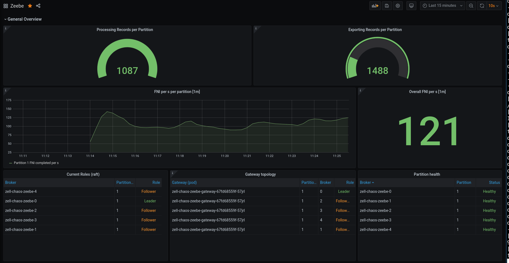

When partitioning two followers, this means we would have two groups. First group would be Broker-0 and Broker-1, the second group contains then Broker-2, Broker-3 and Broker-4. I adjusted the disconnect script from the last chaos day a bit. It looks now like this:

```shell
#!/bin/bash
set -exuo pipefail

# this scripts expects a setup of 5 nodes with replication factor 5 or higher

source utils.sh

partition=1
namespace=$(getNamespace)
gateway=$(getGateway)

broker0=$(getBroker "0")
broker0Ip=$(kubectl get pod "$broker0" -n "$namespace" --template="{ { .status.podIP } }")
broker1=$(getBroker "1")
broker1Ip=$(kubectl get pod "$broker1" -n "$namespace" --template="{ { .status.podIP } }")
broker2=$(getBroker "2")
broker2Ip=$(kubectl get pod "$broker2" -n "$namespace" --template="{ { .status.podIP } }")
broker3=$(getBroker "3")
broker3Ip=$(kubectl get pod "$broker3" -n "$namespace" --template="{ { .status.podIP } }")
broker4=$(getBroker "4")
broker4Ip=$(kubectl get pod "$broker4" -n "$namespace" --template="{ { .status.podIP } }")

# To print the topology in the journal
retryUntilSuccess kubectl exec "$gateway" -n "$namespace" -- zbctl status --insecure

# we put all into one function because we need to make sure that even after preemption the 
# dependency is installed
function disconnect() {
 toChangedPod="$1"
 targetIp="$2"

 # update to have access to ip
 kubectl exec -n "$namespace" "$toChangedPod" -- apt update
 kubectl exec -n "$namespace" "$toChangedPod" -- apt install -y iproute2
 kubectl exec "$toChangedPod" -n "$namespace" -- ip route add unreachable "$targetIp"

}

# Broker 0 and 1 is one group

retryUntilSuccess disconnect "$broker0" "$broker2Ip"
retryUntilSuccess disconnect "$broker0" "$broker3Ip"
retryUntilSuccess disconnect "$broker0" "$broker4Ip"

retryUntilSuccess disconnect "$broker1" "$broker2Ip"
retryUntilSuccess disconnect "$broker1" "$broker3Ip"
retryUntilSuccess disconnect "$broker1" "$broker4Ip"

# Broker 2, 3 and 4 is the other group
retryUntilSuccess disconnect "$broker2" "$broker0Ip"
retryUntilSuccess disconnect "$broker2" "$broker1Ip"

retryUntilSuccess disconnect "$broker3" "$broker0Ip"
retryUntilSuccess disconnect "$broker3" "$broker1Ip"

retryUntilSuccess disconnect "$broker4" "$broker0Ip"
retryUntilSuccess disconnect "$broker4" "$broker1Ip"

```


It works quite well, we can see that another broker took over the leadership and continues with processing. We reach almost the same throughput, interesting is that the activate job requests seem to scale up, which is totally unexpected! We drop now 82% of our requests because we are overloaded with activate job requests.

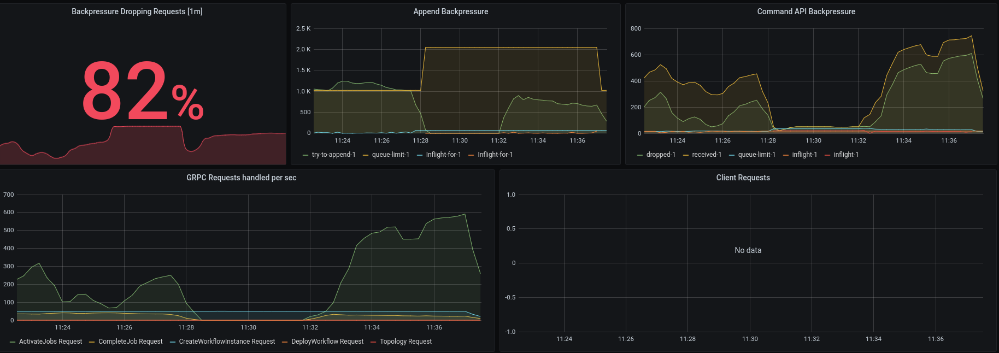

In the atomix section we can see that the both nodes, which are partitioned away, miss a lot of heatbeats and we can see the leader change, which has happened earlier.


Quite early after the network partition a node preemption happened.


We see that the processing completely stops, two reasons here: one is that the gateway was restarted and another is that the leader was restarted and we lost quourum, since we already have the network partition in place. After the restart the Broker-4 actually should know again the other nodes, which is why the heartbeat misses stopped.

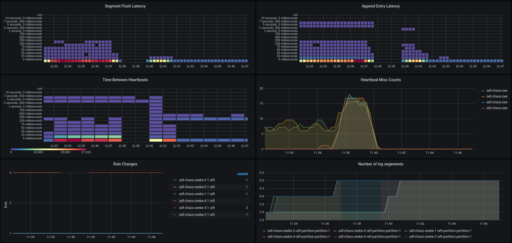

After the Broker comes back the processing started again.

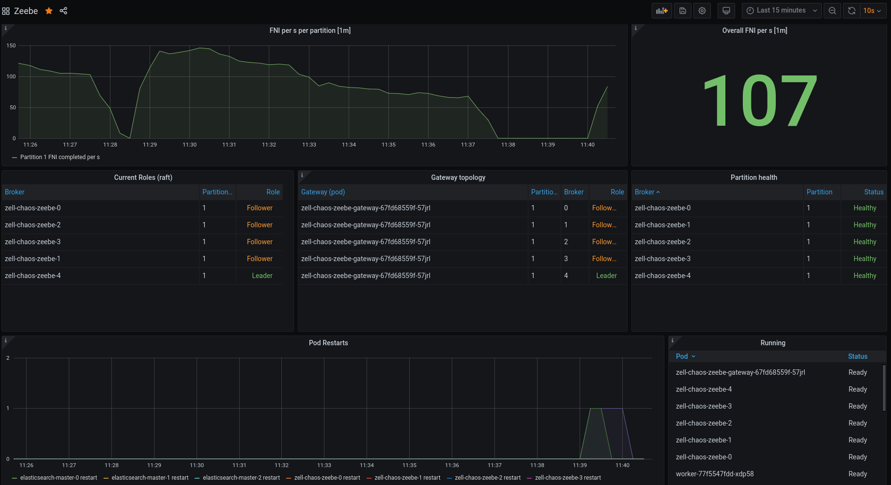

As mentioned earlier the grpc requests increased significantly, we now drop 100% of the requests. We have ~3k incoming activate job requests.


Some time later we can see that the grpc requests has stabilized again.

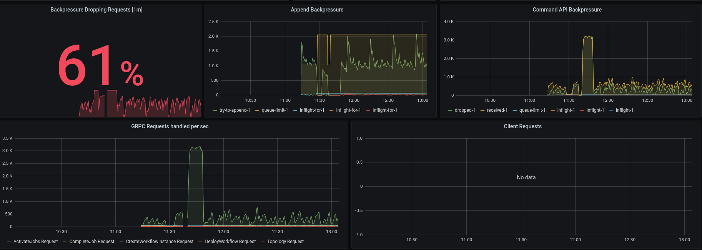

This should be investigated further, but we will stop here with this experiment since it worked as expected that we kept processing even if we partition two brokers away.

## Second Chaos Experiment

After the first experiment succeeded, I wanted to experiment how the cluster behaves if we add one follower back to group one and remove it from the second group. As you might remember we have in the first group (Broker-0, Broker-1) and in the second group (Broker-2, Broker-3, Broker-4).

### Expected 

When the network partition is created and we continue with processing at some point a snapshot is taken and the log is compacted. The first group will not receive any events, which means it has the old state. If we now add Broker-2 to the first group we would expect that the first group now can take over, since it has quorum, and the second will stop working. Before it can start with further processing the Broker-0 and Broker-1 need to get the latest state of Broker-2. We expect that Broker-2 becomes leader in the first group, since it has the longer (latest) log.

### Actual

Again same set up, 5 nodes, one partition and replication factor 3. I'm using the same script as above. I will wait until a snapshot is taken, we could also trigger it now via an end point.

We can see no difference in processing throughput after setting up the network partition again.

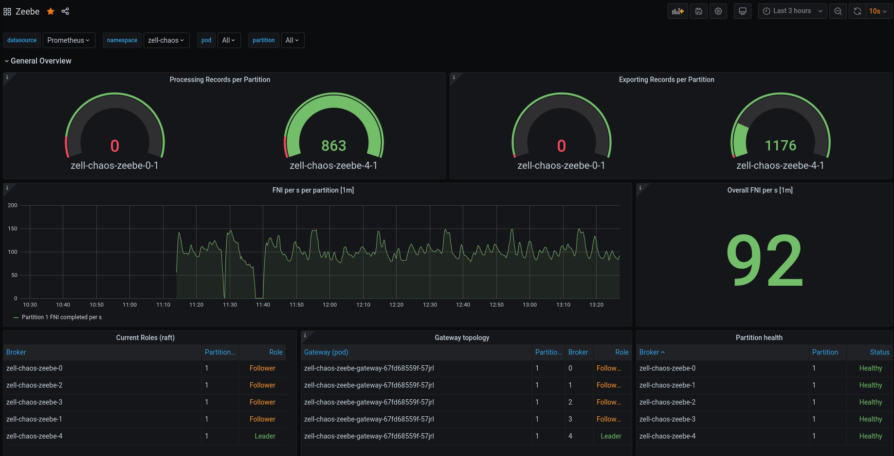

Furthermore, the grpc requests seem to be stable, so it must be something related to the gateway or leader restart.


When we take a look at the atomix metrics we see that both brokers are missing heartbeats, which is expected. 

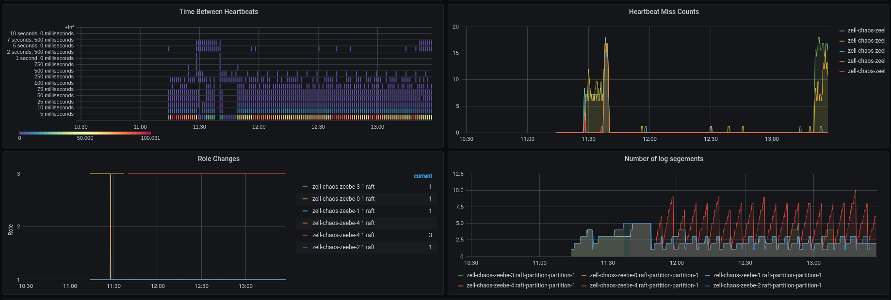

Node preemption wanted to annoy me again... Broker 2 was restarted, because of node preemption. Since we had no quorum, a new election was started. Broker-2 came back voted for Broker-3, but missed soon also heartbeats, so it started an election again and became leader, because it was able to talk with all nodes again. This was not what we wanted to test, but it is nice to know that it works :laughing:

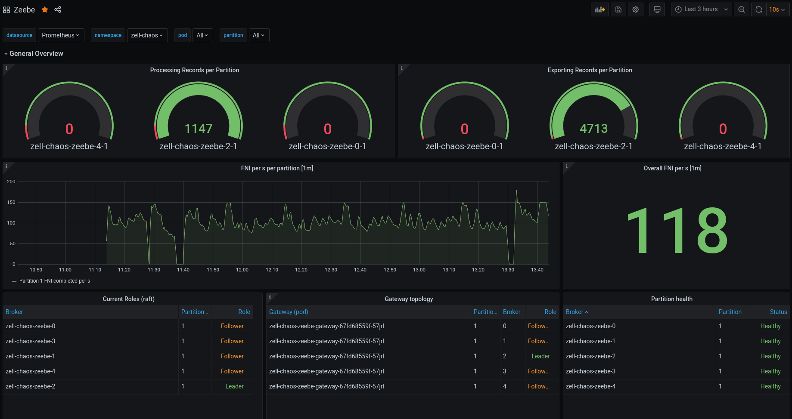

So again, I re-deployed the cluster and created a snapshot by hand (via API).

For that I port-forwarded our admin port (9600)
```shell
$ k port-forward zell-chaos-zeebe-1 9600
```

On the leader we send the POST request to take a snapshot.
```sh
[zell zell-chaos/ cluster: zeebe-cluster ns:zell-chaos]$ curl -X POST http://localhost:9600/actuator/partitions/takeSnapshot
{"1":{"role":"LEADER","snapshotId":"591299-1-1611061561457-718421-717758","processedPosition":723973,"processedPositionInSnapshot":718421,"streamProcessorPhase":"PROCESSING","exporterPhase":"EXPORTING","exportedPosition":722841}}
```

We can see in the metrics that a snapshot was taken (probably two, because I accidently executed the command twice).

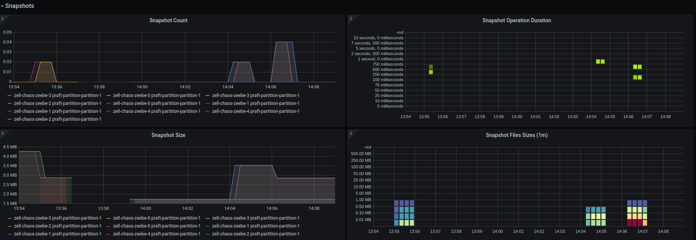

For the Broker 2 we check whether it already received the snapshot:

```shell
[zell zell-chaos/ cluster: zeebe-cluster ns:zell-chaos]$ curl -X GET http://localhost:9600/actuator/partitions
{"1":{"role":"FOLLOWER","snapshotId":"595599-1-1611061566584-723972-722841","processedPosition":null,"processedPositionInSnapshot":null,"streamProcessorPhase":null,"exporterPhase":null,"exportedPosition":null}}
```

We also verify that Broker-0 hasn't received any snapshots nor events.

```shell
[zell zell-chaos/ cluster: zeebe-cluster ns:zell-chaos]$ curl -X GET http://localhost:9600/actuator/partitions
{"1":{"role":"FOLLOWER","snapshotId":"44199-1-1611061147163-76565-53432","processedPosition":null,"processedPositionInSnapshot":null,"streamProcessorPhase":null,"exporterPhase":null,"exportedPosition":null}}
```

After that, we start with the disconnection to group two and connect Broker-2 to group one (Broker-0 and Broker-1).

```shell
 retryUntilSuccess disconnect "$broker2" "$broker3Ip"
 retryUntilSuccess disconnect "$broker2" "$broker4Ip"
 
 retryUntilSuccess connect "$broker2" "$broker0Ip"
 retryUntilSuccess connect "$broker2" "$broker1Ip"   
```

We can see that we now have no leader at all, because I missed to connect the first group with Broker-2 in the reverse and disconnecting group 2 from Broker-2.

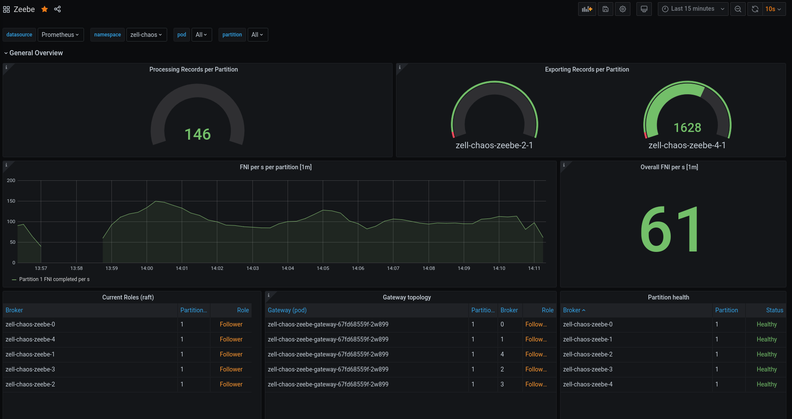

After doing so:

```shell

retryUntilSuccess disconnect "$broker3" "$broker2Ip"
retryUntilSuccess disconnect "$broker4" "$broker2Ip"

retryUntilSuccess connect "$broker0" "$broker2Ip"
retryUntilSuccess connect "$broker1" "$broker2Ip"    
```

We can see in the logs but also in the metrics that snapshots are replicated to Broker-0 and Broker-1.

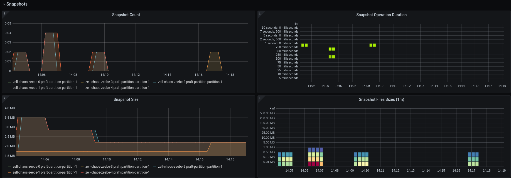

I would expect that we also see something in the atomix snapshot panels, but here it looks like only the duration is published.


After connecting the Broker's we see that Broker-0 and Broker-1 are not missing heartbeats anymore and that a new leader has been chosen, Broker-2 which was the expected leader! 


The processing started and cluster seem to look healthy again.

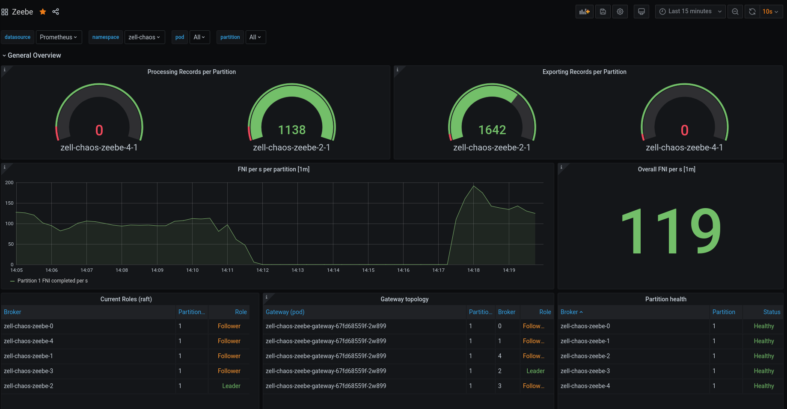

Experiment was successful! :+1:

## New Issues

 * Unexpected request count on network partition/node restart
 * Snapshot metrics are unclear, which show what and Atomix snapshot metrics are not showing values

## Participants

  * @zelldon
