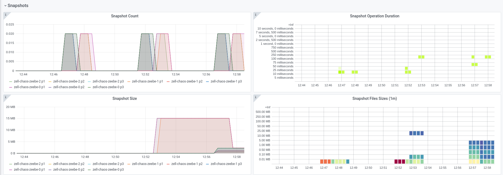
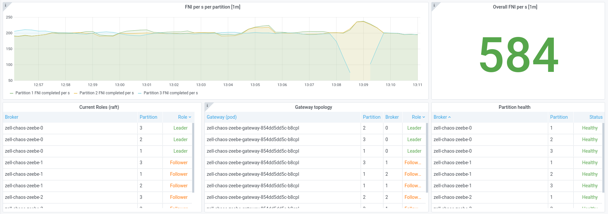
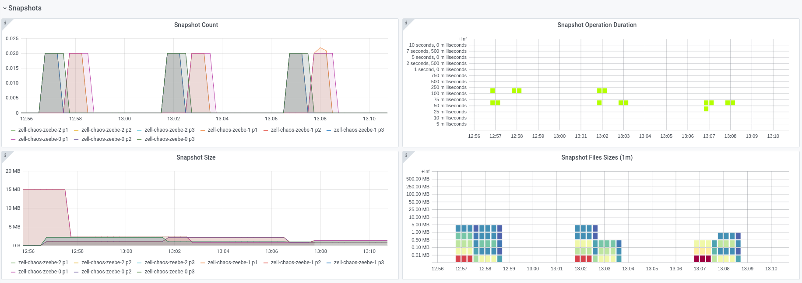
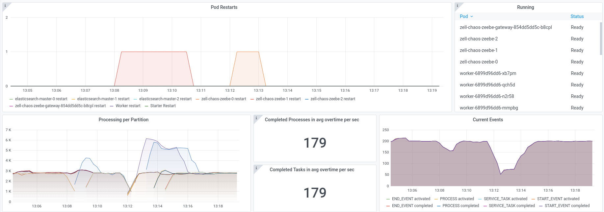
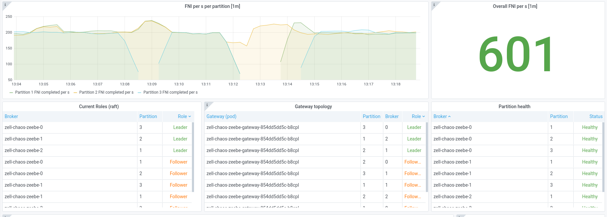
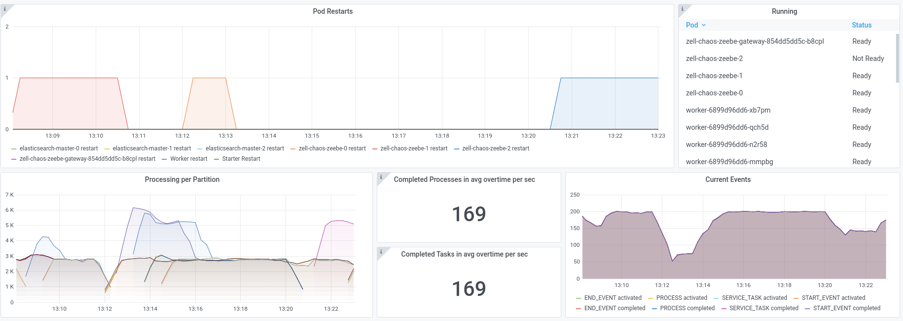
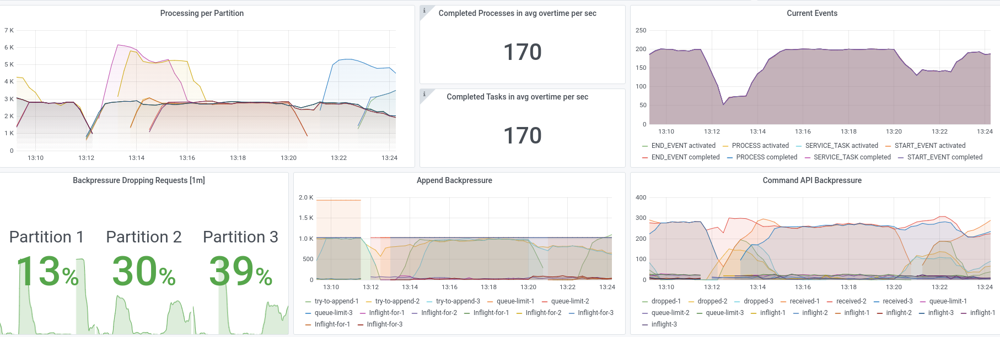

# Chaos Day Summary

A while ago we have written an experiment, which should verify that followers are not able to become leader, if they have a corrupted snapshot. You can find that specific experiment [here](https://github.com/zeebe-io/zeebe-chaos/tree/master/chaos-experiments/helm/snapshot-corruption). This experiment was executed regularly against Production-M and Production-S Camunda Cloud cluster plans. With the latest changes, in the upcoming 1.0 release, we changed some behavior in regard to detect snapshot corruption on followers. 

**NEW** If a follower is restarted and has a corrupted snapshot it will detect it on bootstrap and will refuse to
start related services and crash. This means the pod will end in a crash loop, until this is manually fixed.

**OLD** The follower only detects the corrupted snapshot on becoming leader when opening the database. On the restart of a follower this will not be detected.

The behavior change caused to fail our automated chaos experiments, since we corrupt the snapshot on followers and on a later experiment we restart followers. For this reason we had to disable the execution of the snapshot corruption experiment, see related issue
[zeebe-io/zeebe-cluster-testbench#303](https://github.com/zeebe-io/zeebe-cluster-testbench/issues/303).

In this chaos day we wanted to investigate whether we can improve the experiment and bring it back. For reference, I also opened a issue to discuss the current corruption detection approach [zeebe#6907](https://github.com/camunda-cloud/zeebe/issues/6907)

## Chaos Experiment

This time we look at an already existing experiment. I will run our normal setup and execute the experiment (each step) manually and observe what happens.

### Experiment

```json
{
    "version": "0.1.0",
    "title": "Zeebe can recover from corrupted snapshots",
    "description": "Zeebe should be able to detect and recover from corrupted snapshot",
    "contributions": {
        "reliability": "high",
        "availability": "high"
    },
    "steady-state-hypothesis": {
        "title": "Zeebe is alive",
        "probes": [
            {
                "name": "All pods should be ready",
                "type": "probe",
                "tolerance": 0,
                "provider": {
                    "type": "process",
                    "path": "verify-readiness.sh",
                    "timeout": 900
                }
            },
            {
                "name": "Should be able to create process instances on partition 3",
                "type": "probe",
                "tolerance": 0,
                "provider": {
                    "type": "process",
                    "path": "verify-steady-state.sh",
                    "arguments": "3",
                    "timeout": 900
                }
            }
        ]
    },
    "method": [
        {
            "type": "action",
            "name": "Corrupt snapshots on followers",
            "provider": {
                "type": "process",
                "path": "corruptFollowers.sh",
                "arguments": "3"
            }
        },
        {
            "type": "action",
            "name": "Terminate leader of partition 3",
            "provider": {
                "type": "process",
                "path": "shutdown-gracefully-partition.sh",
                "arguments": [ "Leader", "3" ]
            }
        }
    ],
    "rollbacks": []
}
```

As written before we have our normal benchmark setup and I will run the referenced scripts manually and observe the behavior via grafana. The panels below show the base or steady state.




The first script we will run, corrupts for a certain partition the snapshots of all followers. It does it via just simply deleting some `*.sst` files.

```shell
[zell scripts/ cluster: zeebe-cluster ns:zell-chaos]$ ./corruptFollowers.sh 3
+ ...
+ leader=zell-chaos-zeebe-1
+ followers='zell-chaos-zeebe-0
zell-chaos-zeebe-2'
+ ...
+ kubectl -n zell-chaos exec zell-chaos-zeebe-0 -- ./corrupting.sh 3
+ partition=3
+ partitionDir=data/raft-partition/partitions/3
+ snapshotDir=("$partitionDir"/snapshots/*)
++ find data/raft-partition/partitions/3/snapshots/520492-1-1532470-1531619 -name '*.sst' -print -quit
+ fileName=data/raft-partition/partitions/3/snapshots/520492-1-1532470-1531619/000110.sst
+ rm data/raft-partition/partitions/3/snapshots/520492-1-1532470-1531619/000110.sst
+ ...
+ kubectl -n zell-chaos exec zell-chaos-zeebe-2 -- ./corrupting.sh 3
+ partition=3
+ partitionDir=data/raft-partition/partitions/3
+ snapshotDir=("$partitionDir"/snapshots/*)
++ find data/raft-partition/partitions/3/snapshots/520492-1-1532470-1531619 -name '*.sst' -print -quit
+ fileName=data/raft-partition/partitions/3/snapshots/520492-1-1532470-1531619/000112.sst
+ rm data/raft-partition/partitions/3/snapshots/520492-1-1532470-1531619/000112.sst
```

The second script just terminated the Leader for the referenced partition.

```shell
[zell scripts/ cluster: zeebe-cluster ns:zell-chaos]$ ./terminate-partition.sh "Leader" 3
pod "zell-chaos-zeebe-1" deleted
```

On the first try we had the "luck" that there was a snapshot replication in between, such that the follower was able to become Leader, since it had again a valid snapshot. 




On the second try we were actually able to reproduce the behavior we want to see. We have corrupted the snapshot and restarted the Leader and the partition can make only progress - if the previous leader comes back. This is because the others have a corrupted snapshot and can't take over.




In all cases above we were able to make progress. The issue now arises when one of the affected follower is restarted. For our experiment I restarted Broker-2, which was at this point in time follower for Partition 3. After I restarted the follower it first looked like the partition one was completely down.



After serveral minutes the system recovered and continued.



Via Grafana but also via `kubectl` we can see that the pod doesn't become ready again.

```shell
zell-chaos-zeebe-0                          1/1     Running     0          13m
zell-chaos-zeebe-1                          1/1     Running     0          17m
zell-chaos-zeebe-2                          0/1     Running     0          5m4s
zell-chaos-zeebe-gateway-854dd5dd5c-b8cpl   1/1     Running     0          45m
```

```shell
  Warning  Unhealthy               4m59s               kubelet                  Readiness probe failed: HTTP probe failed with statuscode: 503
  Warning  Unhealthy               9s (x30 over 5m9s)  kubelet                  Readiness probe failed: Get http://10.0.29.26:9600/ready: dial tcp 10.0.29.26:9600: connect: connection refused
```

In camunda cloud this will end in a crash loop, because we restart pods after 15 minutes if they are not ready in time. It is interesting to see that it seems not to restart by itself, **which I had expected**. After checking the logs we can also see why.

```md
I 2021-04-29T11:20:44.205851Z RaftServer{raft-partition-partition-1} - Server join completed. Waiting for the server to be READY 
**W 2021-04-29T11:20:44.220338Z Cannot load snapshot in /usr/local/zeebe/data/raft-partition/partitions/3/snapshots/1387684-4-4014493-4014014. The checksum stored does not match the checksum calculated.** 
D 2021-04-29T11:20:44.737724Z Loaded disk segment: 33 (raft-partition-partition-3-33.log) 
D 2021-04-29T11:20:44.738579Z Found segment: 33 (raft-partition-partition-3-33.log) 
D 2021-04-29T11:20:45.024028Z Loaded disk segment: 34 (raft-partition-partition-3-34.log) 
D 2021-04-29T11:20:45.024688Z Found segment: 34 (raft-partition-partition-3-34.log) 
E 2021-04-29T11:20:45.025826Z Bootstrap Broker-2 [6/13]: cluster services failed with unexpected exception. 
I 2021-04-29T11:20:45.038260Z Closing Broker-2 [1/5]: subscription api 
D 2021-04-29T11:20:45.040467Z Closing Broker-2 [1/5]: subscription api closed in 1 ms 
I 2021-04-29T11:20:45.040926Z Closing Broker-2 [2/5]: command api handler 
D 2021-04-29T11:20:45.042116Z Closing Broker-2 [2/5]: command api handler closed in 1 ms 
I 2021-04-29T11:20:45.042524Z Closing Broker-2 [3/5]: command api transport 
D 2021-04-29T11:20:46.163435Z Created segment: JournalSegment{id=2, index=1556849} 
I 2021-04-29T11:20:47.065203Z Stopped 
D 2021-04-29T11:20:47.066007Z Closing Broker-2 [3/5]: command api transport closed in 2023 ms 
I 2021-04-29T11:20:47.066552Z Closing Broker-2 [4/5]: membership and replication protocol 
E 2021-04-29T11:20:47.067664Z Closing Broker-2 [4/5]: membership and replication protocol failed to close. 
I 2021-04-29T11:20:47.069050Z Closing Broker-2 [5/5]: actor scheduler 
D 2021-04-29T11:20:47.069503Z Closing actor thread ground 'Broker-2-zb-fs-workers' 
D 2021-04-29T11:20:47.071276Z Closing actor thread ground 'Broker-2-zb-fs-workers': closed successfully 
D 2021-04-29T11:20:47.071642Z Closing actor thread ground 'Broker-2-zb-actors' 
D 2021-04-29T11:20:47.073287Z Closing actor thread ground 'Broker-2-zb-actors': closed successfully 
D 2021-04-29T11:20:47.074101Z Closing Broker-2 [5/5]: actor scheduler closed in 4 ms 
I 2021-04-29T11:20:47.074468Z Closing Broker-2 succeeded. Closed 5 steps in 2036 ms. 
**E 2021-04-29T11:20:47.074845Z Failed to start broker 2!** 
I 2021-04-29T11:20:47.078669Z 

Error starting ApplicationContext. To display the conditions report re-run your application with 'debug' enabled. 
**E 2021-04-29T11:20:47.093828Z Application run failed** 
I 2021-04-29T11:20:47.120419Z Shutting down ExecutorService 'applicationTaskExecutor' 
I 2021-04-29T11:20:47.132016Z RaftServer{raft-partition-partition-1}{role=FOLLOWER} - No heartbeat from null in the last PT2.926S (calculated from last 2926 ms), sending poll requests 
I 2021-04-29T11:20:47.260582Z RaftServer{raft-partition-partition-1} - Found leader 0 
I 2021-04-29T11:20:47.262407Z RaftServer{raft-partition-partition-1} - Setting firstCommitIndex to 1507899. RaftServer is ready only after it has committed events upto this index 
I 2021-04-29T11:20:47.263428Z RaftPartitionServer{raft-partition-partition-1} - Successfully started server for partition PartitionId{id=1, group=raft-partition} in 10098ms 
D 2021-04-29T11:21:05.128572Z Created segment: JournalSegment{id=3, index=1570617} 
D 2021-04-29T11:21:26.376398Z Created segment: JournalSegment{id=4, index=1584886} 
I 2021-04-29T11:21:28.129677Z RaftPartitionServer{raft-partition-partition-2} - Successfully started server for partition PartitionId{id=2, group=raft-partition} in 51572ms 
```

We can see in the logs that the corruption is detected and the broker seems to stop, but actually it doesn't.
After `Failed to start broker 2` the process should normally end. It looks like the thread for the other raft partitions are still running and continuing. This is a bug which I reported in one of my last chaos days,
see [camunda-cloud/zeebe#6702](https://github.com/camunda-cloud/zeebe/issues/6702).

With this current behavior we could easily fix the snapshot corruption experiments, since we just need a separate clean up step. It could look like this:

```shell
 k exec -it zell-chaos-zeebe-2 -- rm -r data/raft-partition/partitions/3 # remove partition three data
 k delete pod zell-chaos-zeebe-2 # restart broker 2
```

I tried this and it worked, after some minutes the Broker-2 was able to come back.


Why does it work you may ask. If we remove the corrupted partition data from the follower and restart it, then it will join the cluster with an empty state. The Leader for that partition will immediately replicate the snapshot for that partition, such that the follower is up to date again. This allows the follower then to bootstrap without issues again.

One problem with this approach we have if we actually fix the bug above, where we're not shutting down, then we have the issue that we might not be able to access the data, since the pod is not up. I need to do some more research to solve this, but one possible solution I can think of would be to patch the *StatefulSet*, such that we can claim the PV via multiple pods. This would allow us to start a separate POD in order to access the data and delete it.

## Found Bugs

 * Broker is not shutting down properly [camunda-cloud/zeebe#6702](https://github.com/camunda-cloud/zeebe/issues/6702)


