# Chaos Day Summary

In the last quarter we worked on a new "feature" which is called "building state on followers". In short,
it means that the followers apply the events to build there state, which makes regular snapshot 
replication unnecessary and allows faster role transition between Follower-to-Leader. In this chaos
day I wanted to experiment a bit with this property, we already did some benchmarks [here](https://github.com/camunda-cloud/zeebe/issues/7515).
Today, I want to see how it behaves with larger state (bigger snapshots), since this needed to be
copied in previous versions of Zeebe, and the broker had to replay more than with the newest version.

If you want to now more about build state on followers check out the [ZEP](https://github.com/zeebe-io/enhancements/blob/master/ZEP007-build-state-on-followers.md)

**TL;DR;** In our experiment we had almost no downtime, with version 1.2, the new leader was very fast able to pick up the next work (accept new commands). 

<!--truncate-->

## First Chaos Experiment

We will run two benchmarks one with 1.1 version and one with 1.2, to compare the differences between 
the versions. We will run three brokers, with one partition and replication factor three. 

In order to build up state we run the `starter` with a `durationLimit`, example cfg:

```shell
            value: >-
              -Dapp.brokerUrl=zell-chaos-12-zeebe-gateway:26500
              -Dapp.starter.rate=100
              -Dapp.starter.durationLimit=1000
              -Dzeebe.client.requestTimeout=62000
              -XX:+HeapDumpOnOutOfMemoryError
```

This means that we run a rate of 100 PI/s creations over 1000 seconds. We expect at the end around 
100.000 PI, which should be enough to simulate a "big state". 

After executing the starters we can see in the metrics the running instances:


And that the snapshot is around 600 to 700 MB.

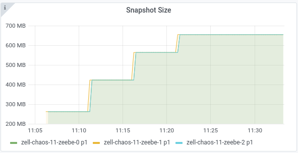

### Expected

We expect that if we restart the current leader that a new leader is fast (under seconds) able to
take over and continues the work. The version 1.2 should perform here much better than 1.1.

### Actual

Just normal bootstrap takes some time, on version 1.1:


For version 1.2:


After running the starters for a certain duration and restarting the leader we can see that 
the processor recovery takes by *factor 10* longer on version 1.1. Unfortunately, we have not the
leader transition metric in that version to compare against.

| **Version** | **1.1**  |  **1.2**  |
|---|---|---|
| Recovery  | [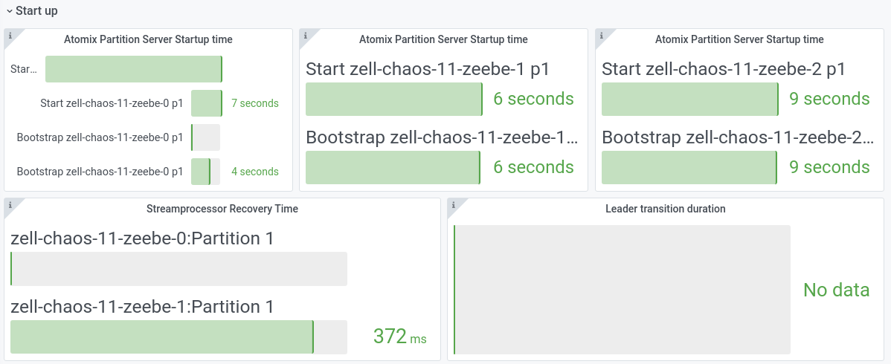](base-recovery.png) | [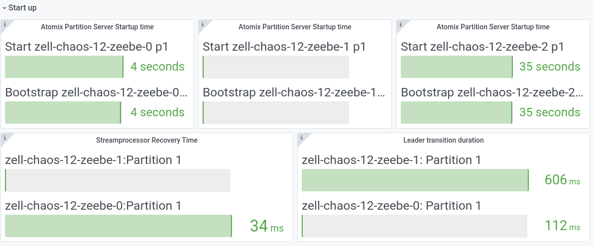](12-recovery.png) | 
| General  | [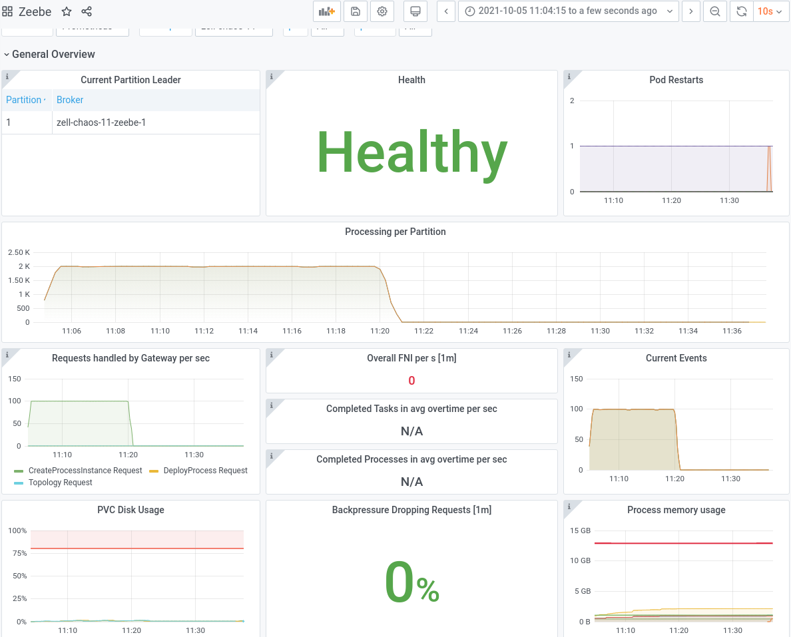](base-recovery-general.png)  | [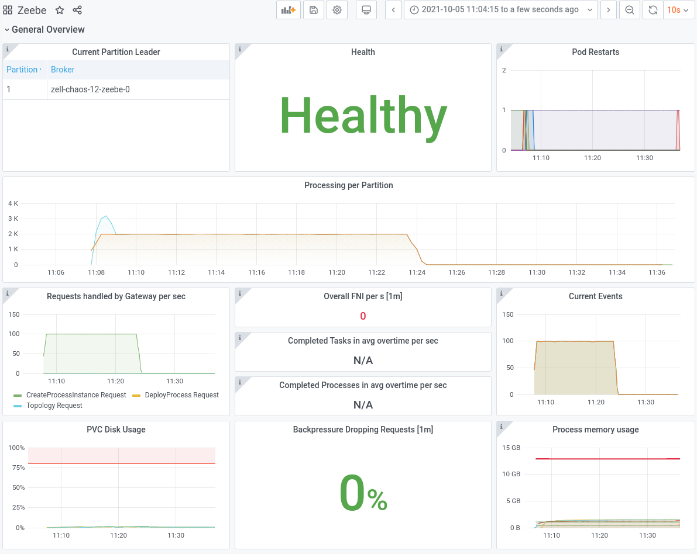](12-recovery-general.png)  | 

*Sorry for the small pictures*

In general what we have seen is that it is not so easy to compare if there is no longer load on the
system, which is the reason I did a second experiment with: A) "big state" and B) steady load.

## Second Chaos Experiment

Similar setup to the first experiment, but additionally after the "big state" is reached a steady
load is put on the system. One starter with a rate of 100 PI/s and one worker completing some jobs.

With that setup we want to verify how it affects the system if now a leader change happens.

### Expected

Similar to above expect that if we restart the current leader that a new leader is fast 
(under seconds) able to take over and continues the work. The version 1.2 should perform here much
better than 1.1.

### Actual


| **Version** | **1.1**  |  **1.2**  |
|---|---|---|
| Recovery  | [](base-general-state-and-throughput-recover-time.png) | [](12-general-state-and-throughput-recovery-time.png) | 
| General  | [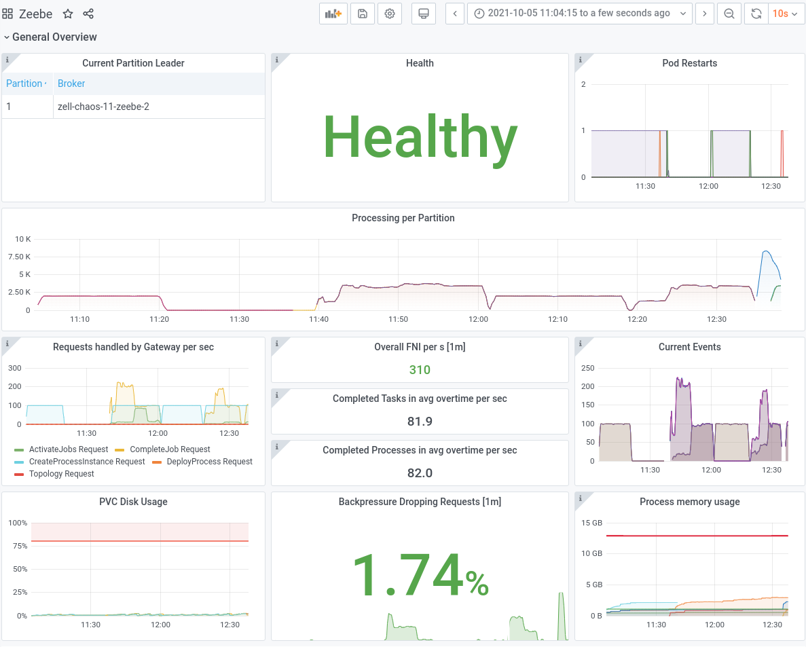](base-general-state-and-throughput-recover-general.png)  | [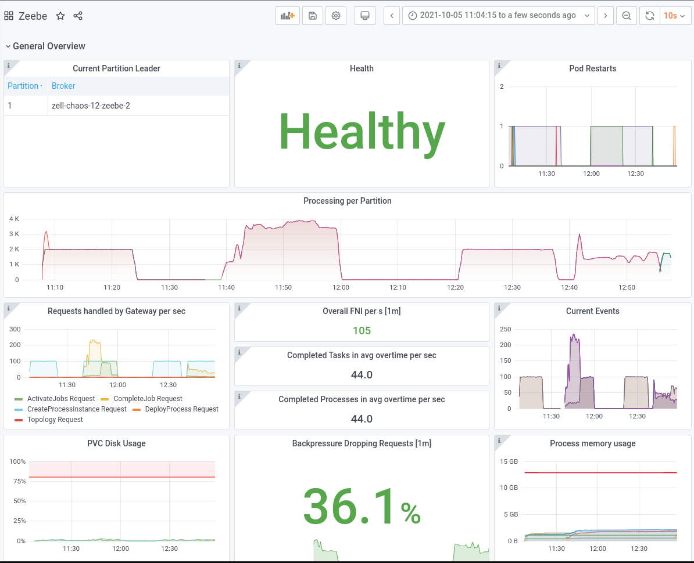](12-general-state-and-throughput-recovery-general.png)  |

After running the experiment again, this time with load, we can see that the version 1.1 took almost
2 minutes! The newest Zeebe version (1.2), with building state on followers, took ~80 milliseconds!

We can see this much better also in the processing and throughput metrics on version 1.1 we have ~2
minutes gap.

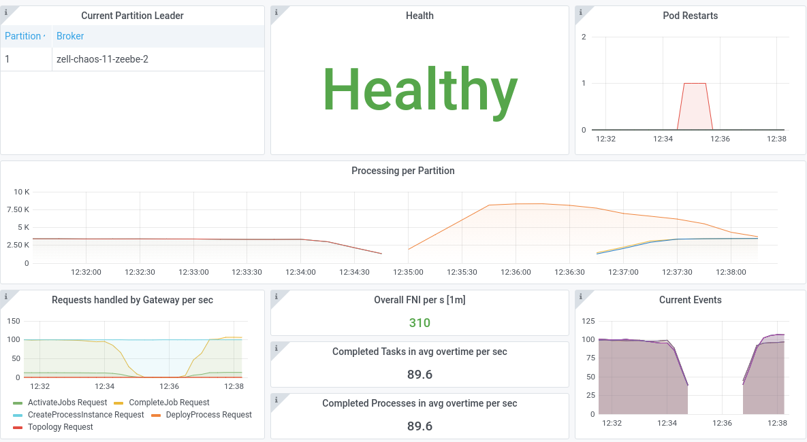

The exporters can recover a bit faster than the processing, but we are for a while not able to accept
any commands.

In version 1.2 on the other hand we are able to almost immediately continue with the processing, some
metrics are not even able to show a gap in between, like the current events.

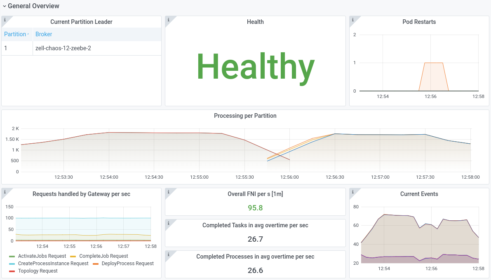

# Result

In general, we were able to show that the new approach of building state on followers, gives us an
excellent benefit in transitioning between Follower and Leader. Furthermore, it allows us to handle
much larger state, since this doesn't need to be replicated on a regular basis.

# Found Bugs

## Running Instances

When experimenting with the clusters, building the state and deploying the steady load I 
accidentally deployed to many workers. This caused to complete all existing running instances. The 
issues here is that on the new leader the metric is zero, which results in a negative metric. 


More problematic is actually that if you than build state again, you might reach the zero and if you
observe the cluster you can't be sure what the actual count of instances are. This makes the metric
kind of useless.


## Performance

During the experimenting it looked like that the performance of 1.2 degraded compared to 1.1. At the
end I had on each benchmark one starter with 100 PI/s and one worker with capacity 12.

With version 1.1 it looked like we reached ~100 PI/s created/completed
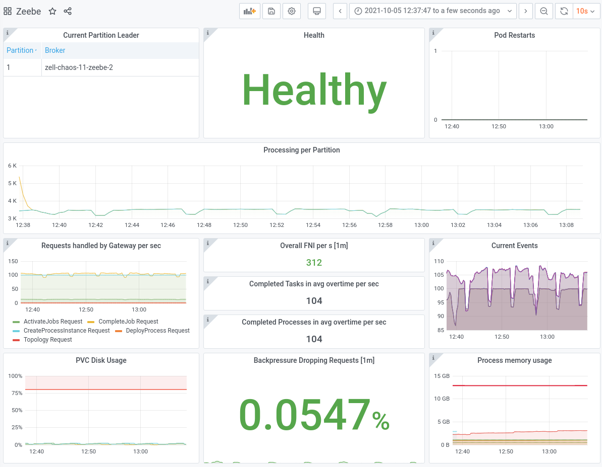

With version 1.2 we just reached ~30, which means it reduced by factor 3.
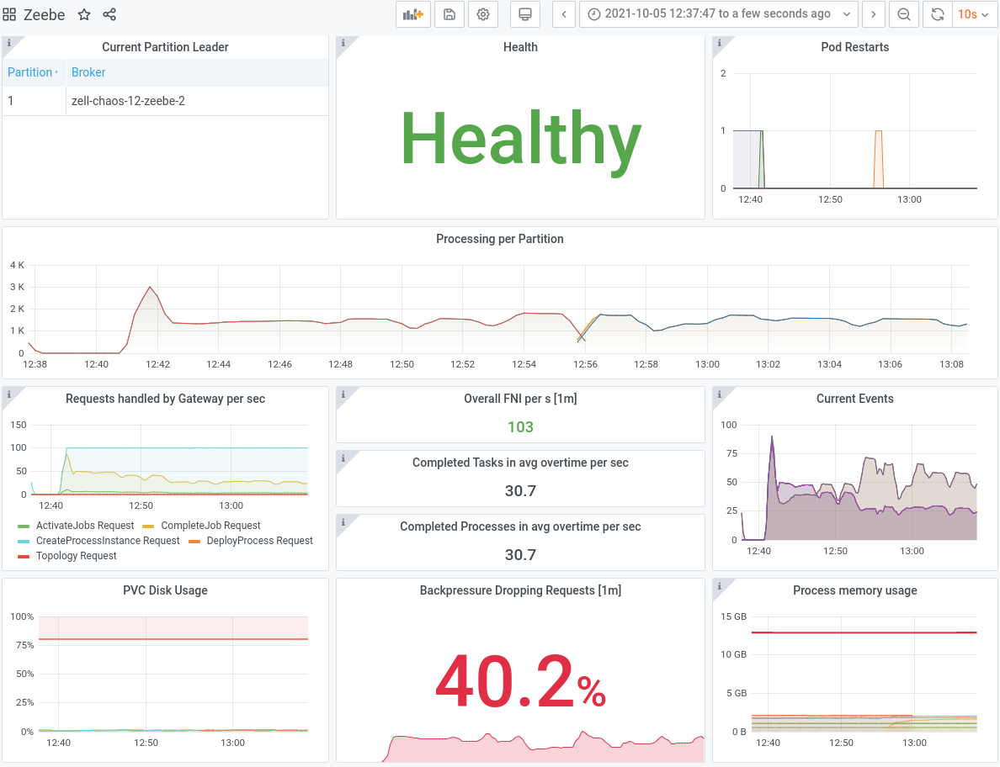

I think we need to verify whether this is really the case.

**Update:**

I run again a benchmark for both versions, with one worker and one starter. It showed no significant 
difference on throughput.

| **Version** | **1.1**  |  **1.2**  |
|---|---|---|
| Performance  | [](perf-11.png) | [](perf-12.png) |

My current assumption is that it was related to the previous build up state and switching between 
different worker configurations etc. Let us see whether we can observe this again.
