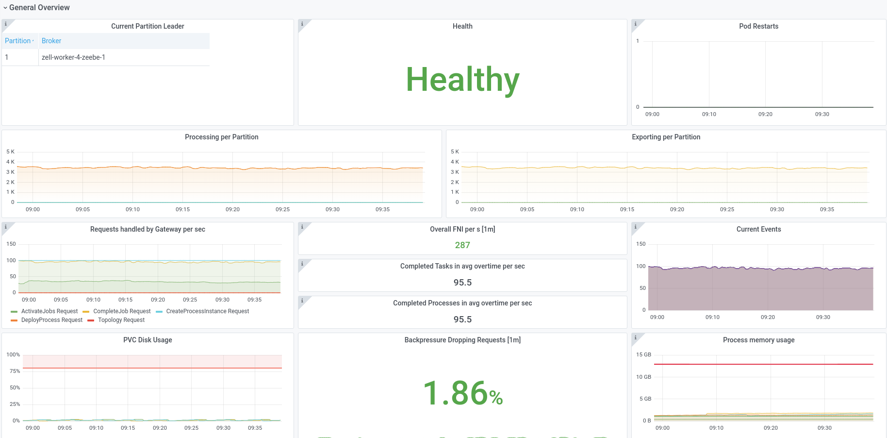
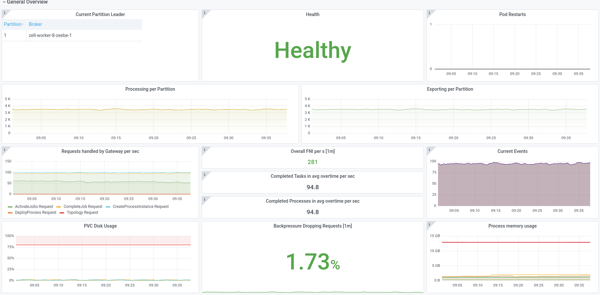
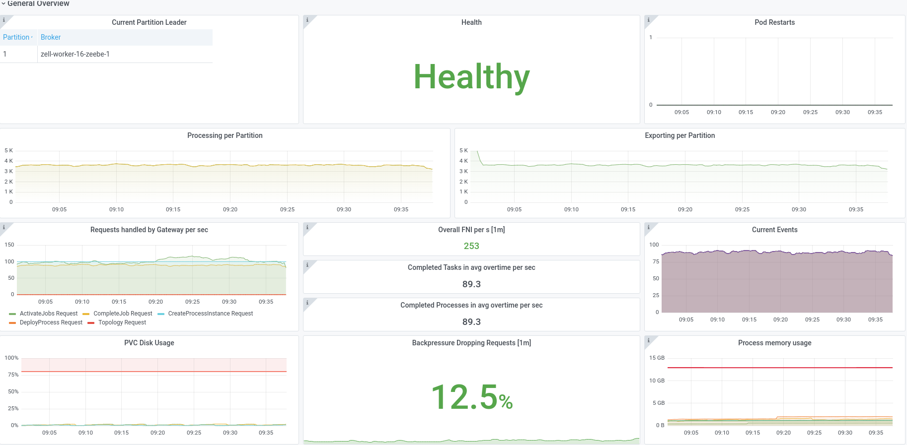
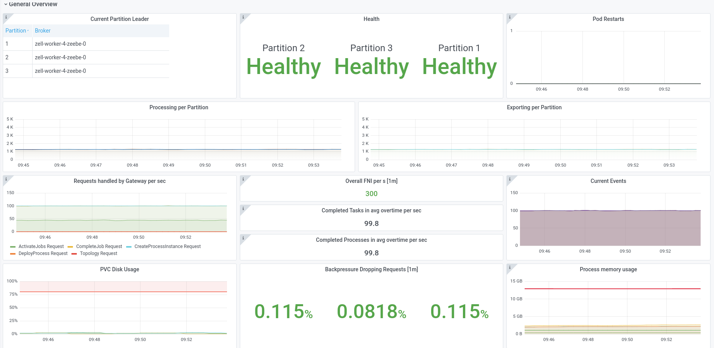
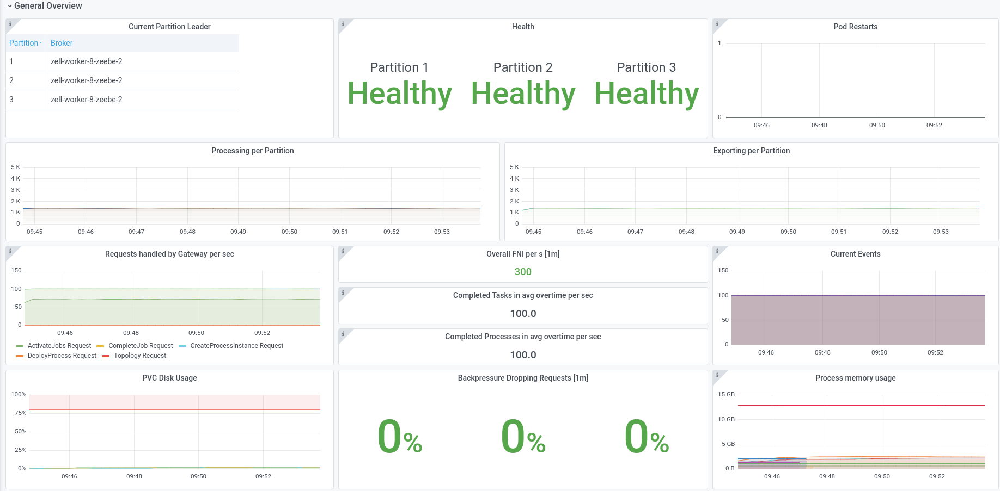
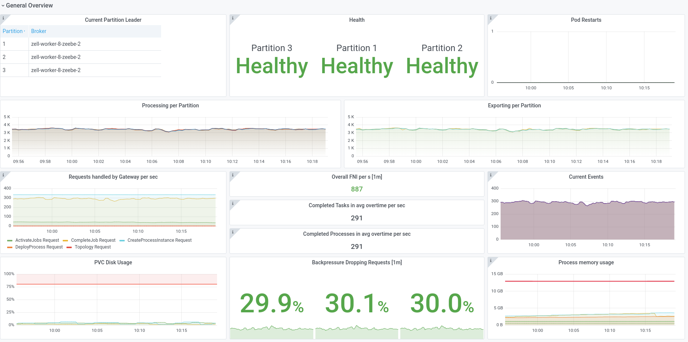
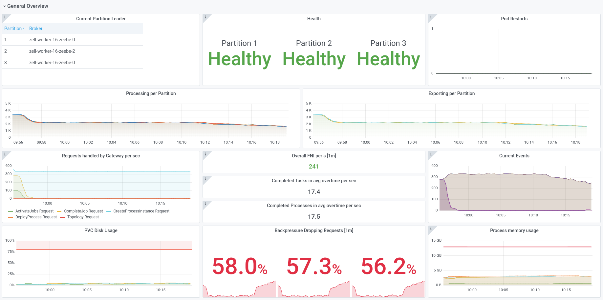

# Chaos Day Summary

In this chaos day we experimented with the worker count, since we saw recently that it might affect the performance (throughput) negatively if there are more workers deployed. This is related to [#7955](https://github.com/camunda-cloud/zeebe/issues/7955) and [#8244](https://github.com/camunda-cloud/zeebe/issues/8244).

We wanted to prove, that even if we have more workers deployed the throughput of the process instance execution should not have an negative impact.

**TL;DR;** We were not able to prove our hypothesis. Scaling of workers can have a negative impact on performance. Check out the [third chaos experiment](#third-chaos-experiment).

<!--truncate-->

## First Chaos Experiment

We run the first experiment with one partition, three brokers, one standalone gateway and one starter which creates 100 PI/s. In this experiment we deployed different zeebe [benchmarks](https://github.com/camunda-cloud/zeebe/tree/develop/benchmarks) with 4, 8 and 16 workers.

### Expected

The workers should be able to complete all created instances and if the workers are scaled the throughput should remain.

### Actual

#### 4 Worker

#### 8 Worker

#### 16 Worker

##### Result 

What we can see is that if we increase the worker number it will decrease the throughput, this might be explained with the case that we sent more activation requests / commands which need to be handled by the Brokers. We can see that the back pressure is higher with 16 workers.

## Second Chaos Experiment

We will repeat first experiment with some changes, to the partition count. We will now use three partitions.

### Expected

The workers should be able to complete all created instances and if the workers are scaled the throughput should remain or be better.

### Actual

#### 4 Worker

#### 8 Worker

#### 16 Worker

##### Result 

In this experiment we can see that all benchmarks reach almost the same throughput, since we not really stressing the system and have enough resources to work with. There is no backpressure at all. In the next experiment we will increase the load.

## Third Chaos Experiment

We will repeat second experiment with some changes to the instance creation count. We will now start 300 process instances per second, with one starter.

### Expected

The workers should be able to complete most of the instances, we would expect that with more workers we would be able to complete more instances and have no negative impact on the system.

### Actual

#### 4 Worker

#### 8 Worker

#### 16 Worker

##### Result 

Between eight and four workers we see the expected difference, that more workers increases the throughput and we are able to complete more instances in a second. The result of 16 workers is completely unexpected. We observed that after short time frame the completion throughput completely droped, and only process instances are created. 

We were able to reproduce this behavior, which shows the weakness again.

We were not able to prove our hypothesis, that scaling of workers has no negative impact on performance.

## Further Analysis

We created a bug issue to analyze and fix this weakness [#8267](https://github.com/camunda-cloud/zeebe/issues/8267).