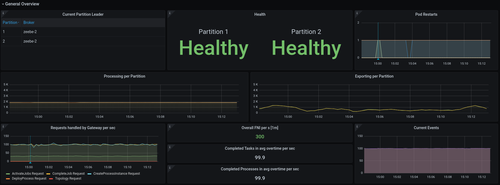

# Chaos Day Summary

We recently introduced the Zeebe Standalone Gateway in CCSaaS. Today I wanted to do a first simple 
chaos experiment with the gateway, where we just restart one gateway. 

Ideally in the future we could enable some gateway chaos experiments again, which we currently only support for [helm](https://github.com/zeebe-io/zeebe-chaos/tree/master/chaos-workers/chaos-experiments/helm).

**TL;DR;** Our Camunda Cloud clusters can handle gateway restarts without issues. 

<!--truncate-->

## Chaos Experiment

This experiment is a simple restart / kill pod experiment. We want to verify that our cluster
can still make progress even if a gateway is restarted / killed in between. Currently, we are running two gateway replicas in the CCSaaS. 

In order to start with our experiment we created a new CCSaaS cluster with a `Production - S` plan, and the latest version (1.3.4). 
To run some load on the cluster we used the cloud benchmark deployments, which you can find [here](https://github.com/camunda-cloud/zeebe/tree/main/benchmarks/setup/cloud-default).
The load was rather low with ~ 100 PI/s.

### Expected

_Hypothesis: When restarting / killing a zeebe standalone gateway we expect only a small 
impact on current requests, new requests should be routed to the right gateway and the cluster can
make progress._


### Actual

After creating the cluster and starting the benchmark we checked the current resource usage, to find a cluster which does most of the work. It looks like that the requests are well distributed.
```shell
[zell zell-chaos/ cluster: ultrachaos ns:448f5091-8d15-4c01-a0ee-202437c09d83-zeebe]$ k top pod
NAME                                                     CPU(cores)   MEMORY(bytes)   
...      
zeebe-gateway-6c9f95b557-f2zbf                           294m         407Mi           
zeebe-gateway-6c9f95b557-gk57z                           202m         396Mi
```

We deleted the first pod `zeebe-gateway-6c9f95b557-f2zbf` and observed the metrics.
```
[zell zell-chaos/ cluster: ultrachaos ns:448f5091-8d15-4c01-a0ee-202437c09d83-zeebe]$ k delete pod zeebe-gateway-6c9f95b557-f2zbf
pod "zeebe-gateway-6c9f95b557-f2zbf" deleted
```

We can see that a new gateway pod is created quite fast.

```
[zell zell-chaos/ cluster: ultrachaos ns:448f5091-8d15-4c01-a0ee-202437c09d83-zeebe]$ kgpo
NAME                                                     READY   STATUS             RESTARTS   AGE
...
zeebe-gateway-6c9f95b557-flgz6                           0/1     Running            0          16s
zeebe-gateway-6c9f95b557-gk57z                           1/1     Running            0          156m
```

As expected we see no high impact due to the restart. 



Just out of interest I deleted all gateway pods:

```shell
$ k delete pod -l app.kubernetes.io/component=standalone-gateway
pod "zeebe-gateway-6c9f95b557-flgz6" deleted
pod "zeebe-gateway-6c9f95b557-gk57z" deleted
```

We can see that the throughput goes almost directly down, but recovers again. It took ~4 min until we
reached the normal state (normal throughput of 100 PI/s) again. But we can also see that it is only a short period
of time, where nothing happens. 


Ideally we would define some anti-affinity on the gateway pods, to reduce the risk of losing all gateways at once.

## Result

We were able to verify and proof our hypothesis.

> _Hypothesis: When restarting / killing a zeebe standalone gateway we expect only a small
impact on current requests, new requests should be routed to the right gateway and the cluster can
make progress._

As we saw above the resources were almost equally used, which is in our normal zeebe benchmarks not the case. 
In the benchmarks we use the helm charts and there is no ingress controller enabled, 
so we have no good load balancing of the incoming requests.

The benefit of the standalone gateway now stands out: losing one is not too problematic than one broker with an embedded gateway,
since a broker takes longer to restart and is likely to be an leader for a partition, which will then also cause a leader change. 
Furthermore, we can scale the gateways independently. 

## Found Issues

### Optimize resources

During experiment with the CCSaaS cluster I observed that the Optimize importer was crashlooping due to this load (PI 100/s).

```shell
[zell zell-chaos/ cluster: ultrachaos ns:448f5091-8d15-4c01-a0ee-202437c09d83-zeebe]$ kgpo
NAME                                                     READY   STATUS             RESTARTS   AGE
...
optimize-deployment-importer-archiver-65679b6449-pb7kz   0/1     CrashLoopBackOff   5          128m
...
```

Checking the pod shows:
```shell
    State:          Waiting
      Reason:       CrashLoopBackOff
    Last State:     Terminated
      Reason:       Error
      Exit Code:    3
      Started:      Tue, 15 Feb 2022 14:25:36 +0100
      Finished:     Tue, 15 Feb 2022 14:26:33 +0100
    Ready:          False
```

Checking the logs we can see that it runs continuously out of memory.
```shell

Zell  13 minutes ago
13:32:48.493 [ZeebeImportScheduler-1] WARN  org.elasticsearch.client.RestClient - request [POST http://elasticsearch:9200/zeebe-record-process-instance/_search?routing=2&typed_keys=true&max_concurrent_shard_requests=5&ignore_unavailable=false&expand_wildcards=open&allow_no_indices=true&ignore_throttled=true&request_cache=false&search_type=query_then_fetch&batched_reduce_size=512&ccs_minimize_roundtrips=true] returned 1 warnings: [299 Elasticsearch-7.16.2-2b937c44140b6559905130a8650c64dbd0879cfb "[ignore_throttled] parameter is deprecated because frozen indices have been deprecated. Consider cold or frozen tiers in place of frozen indices."]
13:32:49.104 [ImportJobExecutor-pool-ZeebeProcessInstanceImportService-0] WARN  org.elasticsearch.client.RestClient - request [HEAD http://elasticsearch:9200/optimize-process-instance-benchmark?ignore_throttled=false&ignore_unavailable=false&expand_wildcards=open%2Cclosed&allow_no_indices=false] returned 1 warnings: [299 Elasticsearch-7.16.2-2b937c44140b6559905130a8650c64dbd0879cfb "[ignore_throttled] parameter is deprecated because frozen indices have been deprecated. Consider cold or frozen tiers in place of frozen indices."]
java.lang.OutOfMemoryError: Java heap space
Dumping heap to java_pid8.hprof ...
Heap dump file created [611503401 bytes in 1.070 secs]
Terminating due to java.lang.OutOfMemoryError: Java heap space
```

### Gateway metrics

It looks like that in our latest ccsm helm charts, we no longer export the gateway metrics which we should fix.

### Gateway Anti-affinity

Currently, we have no anti-affinity defined for the gateway, which could cause on preemption to take down all gateways.
